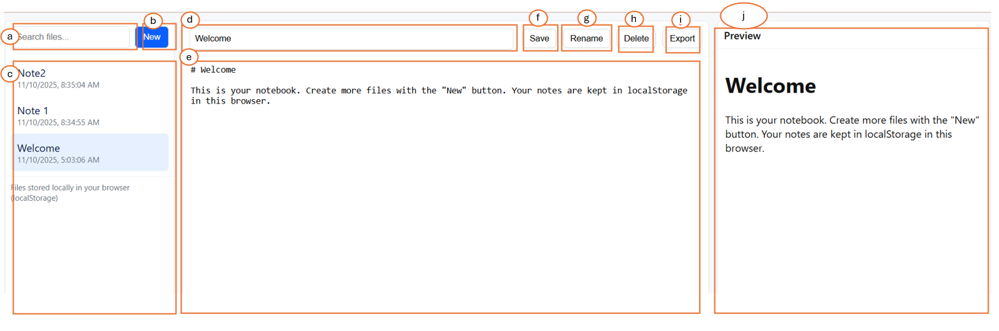

Project: The "Notebook" - Multi-File Markdown Editor
In this project I used the GitHub Copilot (Claude sonnet3.5) in Visual Studio Code. The reason of choosing of it  excellence performance in code manipulation. and this extension in the visual studio code, have the advantage can direct write in the file. and the programing code, i ask the Claude sonnet 3.5 to write the project in JavaScript to write the function of each features, because the JavaScript is the most traditional and comandy use programming language that support web/App developement. Lastly, to visualize the notebook UI and function, I decided to use XAMPP to run the web locally for testing purposes, becuase XAMPP is a opensourve platform for web server solution. 

Below is the step by step of how i write the prompt to the Claude Sonnet 3.5 to generate the project coding:
1. I capture the project descript under The Task section, and the Submission Requirement into the Model. and write the instruction of "write the entire code in the file index.html, script.js, styles.css, to fullfill the requirement of the image above, with using xampp to operate" 
2. Then, run the website locally by enter the address " http://localhost/notebook-editor/ in browser and check does it including the function of file list, markdown editor and live preview. 
3. The generated code has seperate the website to 3 section, first section from left has including search file bar, add new note file button and display file list section. the second section located at the middle, is the editor of the selected file with the button of the Save, Rename, Delete, Export. and the section at the right, is the preview of the note file. it will display the live content of the selected file title and content. 

Instructions
1. Download and install the XAMPP from https://www.apachefriends.org/
2. open the XAMPP control penal, start Apache and MySQL
3. move the entire folder of notebook-editor into this directory: C:\xampp\htdocs\notebook-editor
4.open browser, Navigate to http://localhost/notebook-editor/
5. Below is the UI of the notefile

a. search bar to search note file
b. add new file button
c. File list display
d. display the title of selected file
e. display the content of selected file
f. save newest version of the file
g. Rename the file name
h. Delete the file
i. Export the selected file to Markdown file
j. live preview section of the sected file name and content. 

